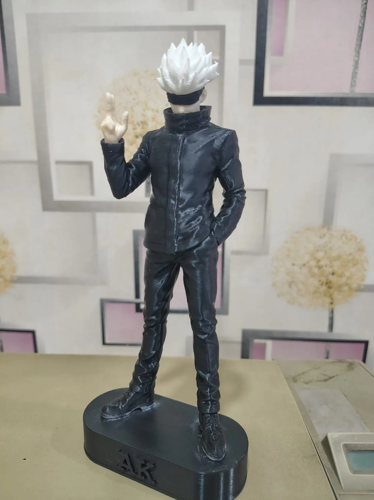
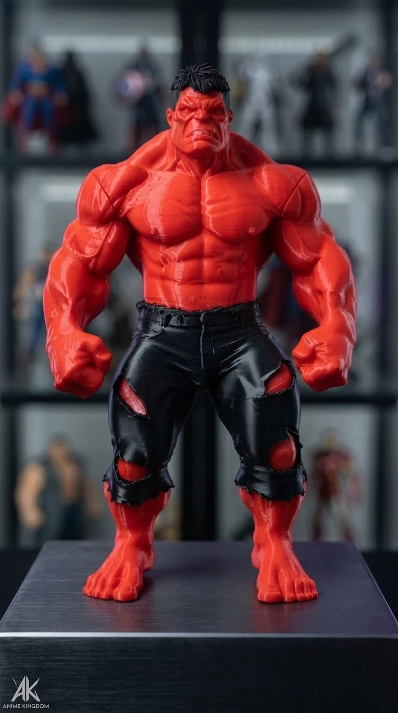
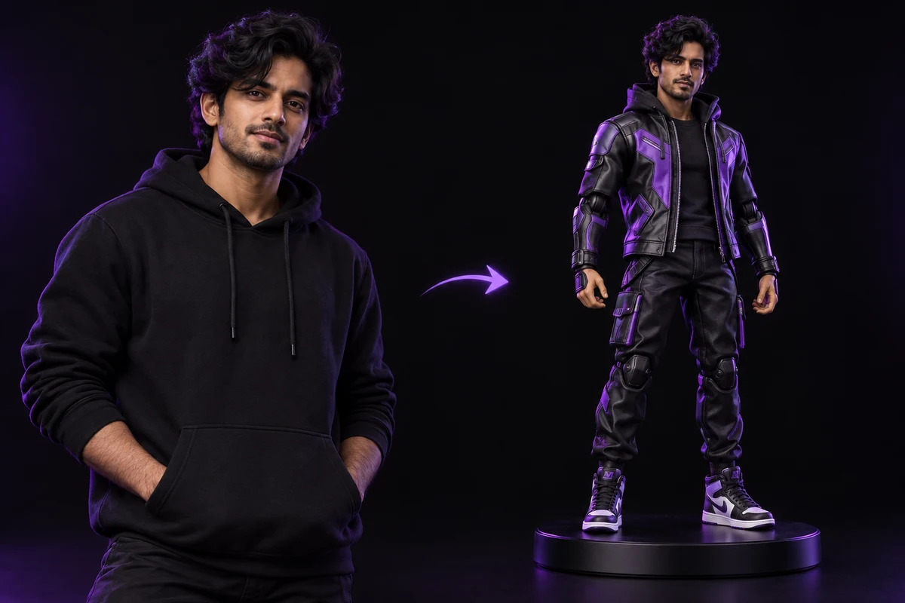
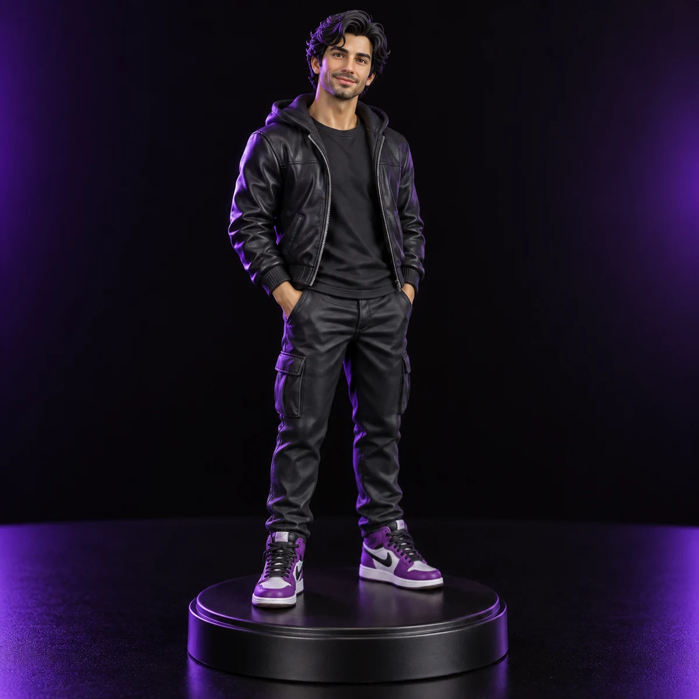
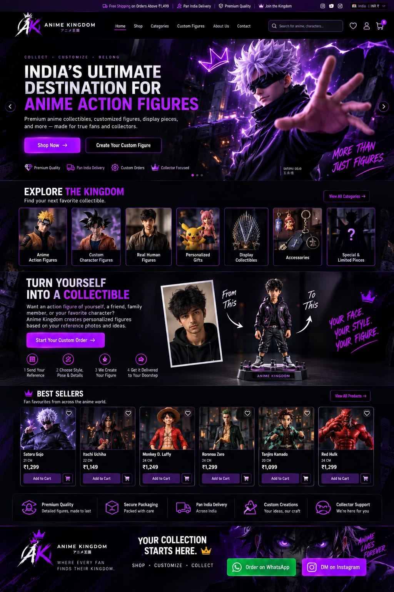

# Website images and custom figure form

This index links to the files in this repository.

## Product photos

| Product | Image |
| --- | --- |
| Gojo Satoru |  |
| Spider-Man |  |
| Red Hulk |  |

## Custom figure artwork

## Category artwork

## Banner and reference poster

## Custom figure details

The form is defined in [work/export-pages.js](work/export-pages.js) in the customPage function. It includes name, email, phone, Instagram ID, character/style, size, pose, accessories, finish, reference image and special requirements. Instagram and WhatsApp contact links are also included.

Submission code is in [work/export-supabase.js](work/export-supabase.js). The published Vite app contains this code in [public/storefront/app.js](public/storefront/app.js).

Customer submissions are private data stored in Supabase, not repository files. Changes made only in the browser's local editor are local to that browser until exported into the website source.

Download the full project using GitHub's Code > Download ZIP, then run npm ci and npm run dev. Open the custom form using #custom.
